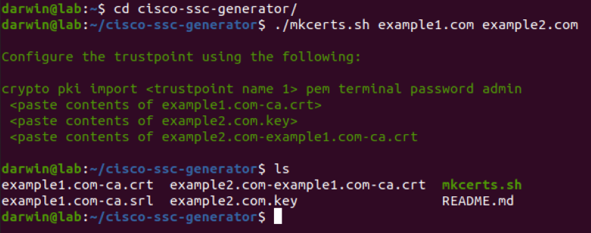
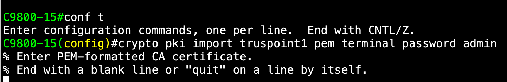
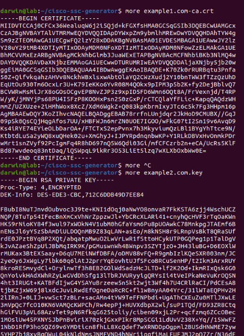
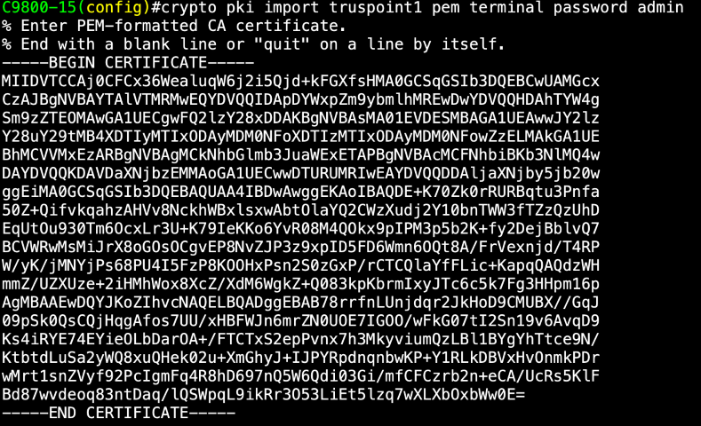
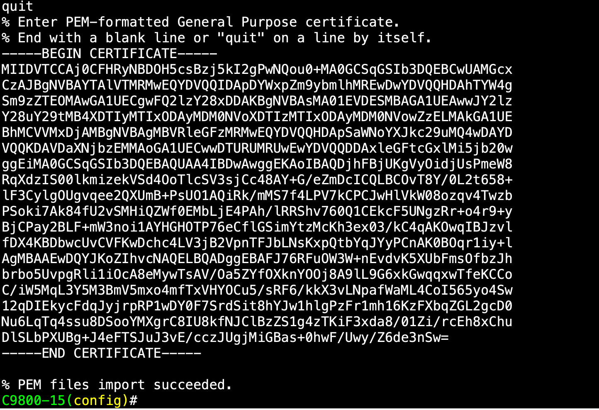

# Cisco SSC Generator

## Script to generate self-signed certificates to use on Cisco IOS-XE devices. 

We are going to use a Cisco C9800-CL and a linux maching for this demo, the certificate should work with any IOS-XE devices.

This was tested with OpenSSL v3.   

### Steps to generate the certificate bundle:
1. Clone the repository, and go to the directory.

```
git clone https://github.com/rwxdan/cisco-ssc-generator/
cd cisco-ssc-generator
```

2. Modify any desire aspect inside the file mkcerts.sh.

**For example:**

The first certificate fields belong to the CA (change any value of your preference):

```
cat <<EOF
[req]
distinguished_name = req_distinguished_name
prompt = no

[req_distinguished_name]
C = US
ST = California
L = San Jose
O = Cisco
OU = MDT
CN = cisco.com
EOF
) > ca.cnf
```

The second and the third certificate fields belongs to the device certificate "C9800-CL"

```
[req_distinguished_name]
C = US
ST = California
L = San Jose
O = Cisco
OU = MDTG
CN = ${1}

[v3_req]
subjectAltName = @alt_names

[alt_names]
DNS.1 = ${1}
EOF

[req_distinguished_name]
C = US
ST = California
L = San Jose
O = Cisco
OU = MDTG
CN = ${2}
EOF
) > ${2}.cnf
```

**IMPORTANT**: keep the same values in the second and the third certificate fields

Additionally, you can add any password of your preference, in this demo we are using admin as a password:

```
openssl req -new -key ${2}.key -out ${2}.csr -config ${2}.cnf -passin ${PASS}:admin
```

3. Save the changes.
4. Run the script and modify the following information with your company domain "example1.com" and "example2.com", example1.com will represent the CA signing the certificate, and example2.com will be the device certificate (in our case the C9800-CL certificate)

**The output should looks like this**:



5. Copy the following crypto command from terminal:

```
crypto pki import <trustpoint name 1> pem terminal password admin
```

Use any trustpoint name of your preference in our case we are going to use "truspoint1" and the password admin (as we've created earlier)

6. Paste the command in your C9800-CL command line, and follow the prompt:



7. In your linux terminal there are 3 "paste contents" with the generated files in the expected order needed for you IOS-XE device, in this example we got:

```
<paste contents of example1.com-ca.crt>
 <paste contents of example2.com.key>
 <paste contents of example2.com-example1.com-ca.crt
```

8. Pull the content of each file and paste in your IOS-XE terminal:



**IMPORTANT**: Make sure you copy `-----BEGIN CERTIFICATE-----` and `-----END CERTIFICATE-----`



At the end, you should get an `import succeeded` like this:



After all, you can use the certificate for a web authentication SSID, or for the web administration of your IOS-XE device!


